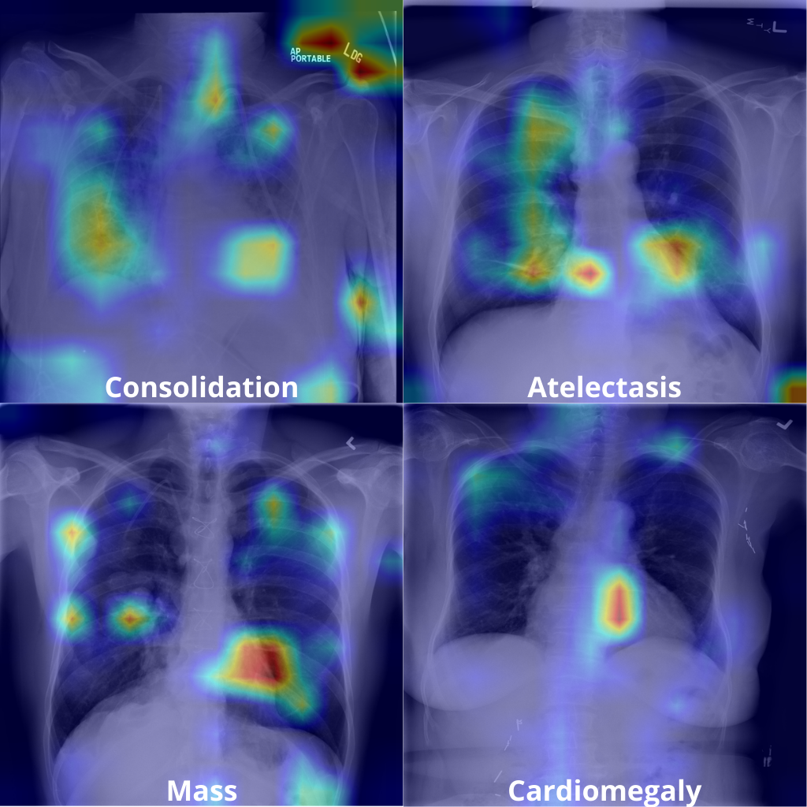

# Generate Grad-CAM Visualizations

To produce Grad-CAM heatmaps for a specific pathology/class, follow the steps below.


## 1. Select the Target Class (Notebook)

Open the notebook: `gradcam_auto_images.ipynb`.

Inside it, choose the class you want to analyze by setting:

```python
TARGET_CLASS_NAME = "Pneumothorax"
```

This notebook will automatically generate a command for Grad-CAM inference.

## 2. Run the Generated Command

Copy the command produced by the notebook and execute it in the terminal from the same directory where the `.txt` file was generated.


## 3. Set the Target Class (Python Script)

In the file `gradcam_auto.py`, make sure the same class is selected:

```python
TARGET_CLASS_NAME = "Pneumothorax"
```

## 4. Configure Input and Output Paths (Shell Script)

Edit the script `gradcam_auto.sh`, updating the following arguments:

- `--image`: Directory containing the images to be analyzed
- `--output_dir`: Directory where Grad-CAM outputs will be saved

Example:

```bash
--image /path/to/images \
--output_dir /path/to/gradcam_results
```

## 5. Execute the Grad-CAM Pipeline
Ensure that the checkpoint corresponding to the best training epoch (highest AUC score) is located in the same directory as `gradcam_auto.py` and `gradcam_auto.sh`. Finally, submit the script for execution:

```bash
sbatch gradcam_auto.sh
```

## Output

After completion, Grad-CAM heatmaps will be saved in the specified output directory, allowing visual interpretation of the model’s attention over the selected class.

# Grad-CAM Results
Below are some Grad-CAM results for comparison with the same classes shown in the original SwinCheX paper.

